# Unicorn Input Method

**Unicorn** is a cross-platform Unicode Input Method designed to allow easy insertion of Agda and Unicode symbols (e.g., typing `\lambda` to get `λ`). It features a "Functional Core, Imperative Shell" architecture, separating the portable logic from the OS-specific interface.

## 🚀 Features & Usage

### Activation
*   **Activate:** Type the backslash `\` character to enter Unicorn Mode. The character will be underlined.
*   **English Input:** When no symbol sequence is active, Unicorn behaves exactly like the default "ABC" input method.

### Typing & Composition
*   **Sequence:** Type characters to extend the sequence (e.g., `l`, `a`, `m`...).
*   **Live Updates:** The input method provides real-time feedback:
    *   **Composition:** The raw buffer (e.g., `\lam`) is shown inline and underlined.
    *   **Candidates:** A floating window displays available symbols matching the current sequence.

### Commitment
*   **Explicit Commit:** Press **Space** or **Enter** to commit the first candidate.
    *   **Space:** Commits the symbol and inserts a space (e.g., `λ `).
    *   **Enter:** Commits the symbol and inserts a newline.
*   **Selection:**
    *   **Number Keys (1-9):** Press a number to select and commit the specific candidate at that index.
    *   **Arrow Keys (Up/Down):** Navigate the candidate list one by one.
    *   **Arrow Keys (Left/Right):** Page Up/Down through the candidate list (in blocks of 9).
*   **Implicit Commit:** If you type a character that is NOT part of a valid sequence (e.g., typing `.` after `\lambda`), Unicorn will automatically commit the best match (`λ`) and then insert the new character (`.`), resulting in `λ.`.

### Special Actions
*   **Backspace:** Deletes the last character in the buffer, reversing the state of the engine.
*   **Double Backslash:** Typing `\\` commits a single `\` character and exits the mode.
*   **Stateful Commits (Re-activation):** For sequences like `\==\`, the engine commits the intermediate result (`≡`) and immediately restarts the composition session. This allows for fluid typing of complex symbols like `≡⟨⟩` without re-activating manually.

---

## 🏗 Architecture

Unicorn follows a clean separation of concerns:

### 1. Functional Core (Rust)
*   **Location:** `crates/core/`
*   **Role:** The brain of the input method. Handles state management, Trie traversal, and symbol lookup.
*   **Data Structure:** Uses a nested `TrieNode` structure loaded from a `keymap.json` file.
*   **State:** Tracks `active` status, `current_node` pointer, candidate selection, and the input `buffer`. It is the **single source of truth** for the input session.

### 2. Imperative Shell (macOS Frontend)
*   **Location:** `apps/macos/`
*   **Role:** The "Dumb Pipe". Handles system events, rendering, and window management via `InputMethodKit`.
*   **Logic:**
    *   Intercepts key events (Backslash, Arrows, Backspace).
    *   Forwards text input to the Rust Engine.
    *   Reacts to Engine Actions: `UpdateComposition`, `ShowCandidates`, `Commit`, `Reject`.
    *   **State Coordination:** Defers session lifecycle (activation/deactivation) to the Rust Engine, ensuring complex sequences are not interrupted.

### 3. FFI Layer (UniFFI)
*   **Location:** `crates/adapter-uniffi/`
*   **Role:** Bridges the gap between Swift and Rust, generating safe, type-safe bindings for the Rust `Engine` struct.

### 🔄 Interaction Flow

The following diagram illustrates how a keystroke travels from the user to the application:

```mermaid
sequenceDiagram
    actor User
    participant App as Target App (TextEdit)
    participant Shell as Swift Shell (InputController)
    participant Core as Rust Core (Engine)
    participant UI as Candidate Window

    User->>App: Types '\' (Backslash)
    App->>Shell: handleEvent(KeyDown)
    Shell->>Core: processKey('\')
    Core-->>Shell: UpdateComposition("\")
    Shell->>App: setMarkedText("\")
    
    User->>App: Types 'l'
    App->>Shell: handleEvent(KeyDown)
    Shell->>Core: processKey('l')
    Core-->>Shell: ShowCandidates("\l", ["λ", ...])
    Shell->>App: setMarkedText("\l")
    Shell->>UI: Show Window(["λ", ...])
    
    User->>App: Types Space
    App->>Shell: handleEvent(KeyDown)
    Shell->>Core: processKey(' ') -> Reject (Implicit Commit)
    Note over Shell: Logic: Commit 'λ' then Space
    Shell->>App: insertText("λ")
    Shell->>UI: Hide Window
    Shell-->>App: Return False (Pass Space)
    App->>App: Insert " "
```



---

## 🛠 Building & Installation

### Prerequisites
*   **Rust:** Stable toolchain **1.92.0** or later (`rustup update`).
*   **Xcode:** For building the macOS app.
*   **UniFFI Bindgen:** Installed automatically via cargo.

### Build & Install
The project includes a `Makefile` to automate the build and installation process:

```bash
# Build everything and install to ~/Library/Input Methods/
make install-macos
```

**What this command does:**
1.  **Rust Build:** Compiles the core logic and generates Swift bindings via UniFFI.
2.  **Xcode Build:** Builds the `unicorn.app` bundle using `xcodebuild`.
3.  **Symlink Installation:** Creates a symbolic link from the build directory to `~/Library/Input Methods/`. This allows you to rebuild the app without manually re-copying it.
4.  **Registration:** Runs `lsregister` to notify macOS of the new Input Method.
5.  **Restart:** Restarts the `unicorn` process to apply changes immediately.

### Enabling the Input Method
Once installed, you must enable it in macOS:
1.  Open **System Settings** -> **Keyboard** -> **Input Sources**.
2.  Click **Edit...** then the **+** button.
3.  Search for **Unicorn** (usually under "English" or "Others").
4.  Select it and click **Add**.
5.  (Optional) Enable **"Use Caps Lock to switch to and from last used input source"** to toggle between Unicorn and your other primary language (e.g., Chinese).

---

## 🧪 Development Commands

*   `crates/`
    *   `core/`: Pure Rust implementation (Trie, Engine).
    *   `adapter-uniffi/`: FFI adapter for Swift generation.
*   `apps/`
    *   `macos/`: Xcode project and Swift source code.
        *   `unicorn/InputController.swift`: Main Swift logic.
        *   `unicorn/keymap.json`: The data source for input sequences.
*   `artifacts/`: Generated bindings (temporary).
*   `Makefile`: Build automation.

## 📝 Development Conventions

*   **Logic in Rust:** All complex logic (Trie navigation, state transitions) belongs in `crates/core`.
*   **UI in Swift:** All UI handling (Candidates window, key interception) belongs in `apps/macos`.
*   **UniFFI:** We use UniFFI to generate safe, idiomatic Swift wrappers. Do not manually edit generated files.